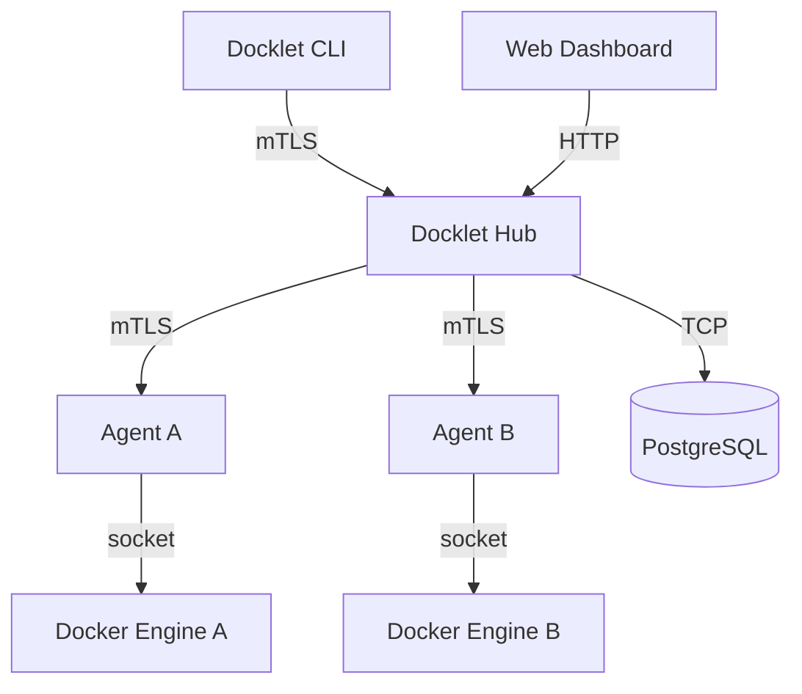

# Docklet

**Docklet** is a secure, decentralized orchestration platform for Docker containers. It enables you to manage thousands of distributed agents from a central hub using a unified CLI and Web Dashboard.

  

## 📚 Architecture

Docklet connects distributed **Agents** to a central **Hub** over a secure gRPC connection.



### Key Features
*   **Secure by Default**: All traffic is encrypted and authenticated using Mutual TLS (mTLS) or Secure Bootstrap Tokens.
*   **Firewall Friendly**: Agents connect outbound to the Hub; no open ports required on Agents.
*   **Web Dashboard**: Built-in React/Vite UI for managing containers, launching apps, and monitoring logs.
*   **Zero-Config Deployment**: Single script installation for both Hub and Agents.

---

## 🚀 Getting Started (Production)

We provide a single `install.sh` script that handles dependencies (Go 1.24+, Node.js), builds the project, and installs systemd services.

### 1. Deploy the Hub (Control Plane)
Run this on your central server:

```bash
curl -fsSL https://raw.githubusercontent.com/ASTRACAT2022/Docklet/main/install.sh | bash -s -- -install hub
```

**Output:**
```
✅ Docklet Hub installed & running!
Dashboard: http://<YOUR_IP>:1499
Bootstrap Token: a1b2c3d4e5f6...
```
*Save the Bootstrap Token! You will need it to connect agents.*

### 2. Deploy Agents (Nodes)
Run this on any server where you want to run containers:

```bash
curl -fsSL https://raw.githubusercontent.com/ASTRACAT2022/Docklet/main/install.sh | bash -s -- -install node <HUB_IP> <BOOTSTRAP_TOKEN>
```
*   `<HUB_IP>`: The IP address of your Hub server.
*   `<BOOTSTRAP_TOKEN>`: The token generated during Hub installation.

The agent will automatically:
1.  Install dependencies (Go, etc.)
2.  Connect to the Hub to fetch secure mTLS certificates.
3.  Register itself as a node.
4.  Start as a systemd service (`docklet-agent`).

---

## 🖥️ Web Dashboard

Access the dashboard at **http://<HUB_IP>:1499**

**Default Credentials:**
*   Username: `astracat`
*   Password: `astracat`

**Features:**
*   **Dashboard**: View all connected nodes and their status.
*   **Container Management**: Start, Stop, Remove, Inspect, and view Logs of containers.
*   **Quick Launch**: Wizard to easily deploy new containers with port mapping and env vars.
*   **Terminal**: Execute commands inside containers directly from the browser.

---

## 🛠 Manual Development Setup

If you want to contribute or build manually:

### Prerequisites
*   Go 1.24+
*   Node.js 20+
*   Docker

### Build
```bash
git clone https://github.com/ASTRACAT2022/Docklet.git
cd Docklet

# Build Binaries
go build -o bin/hub ./cmd/hub
go build -o bin/agent ./cmd/agent
go build -o bin/cli ./cmd/cli

# Build Dashboard
cd web/dashboard
npm install
npm run build
cd ../..
```

### Run Locally
```bash
# Terminal 1: Run Hub
./bin/hub

# Terminal 2: Run Agent
./bin/agent --hub localhost:50051
```

---

## 🔒 Security Details

Docklet enforces **Zero Trust**:
1.  **Bootstrap**: Initial connection uses a secure Token to fetch unique mTLS certificates.
2.  **Communication**: All subsequent communication is encrypted via mTLS.
3.  **Isolation**: Agents only accept commands from the authenticated Hub.

---

## License

This project is licensed under the MIT License.
